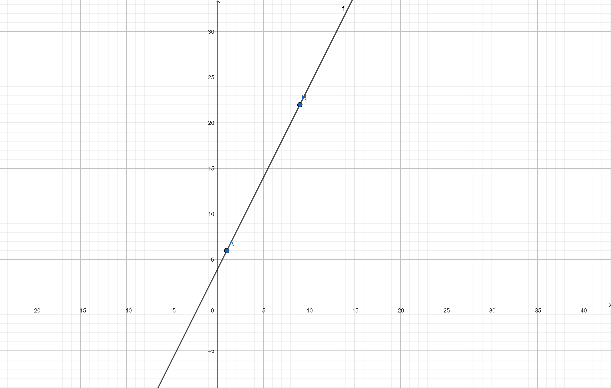
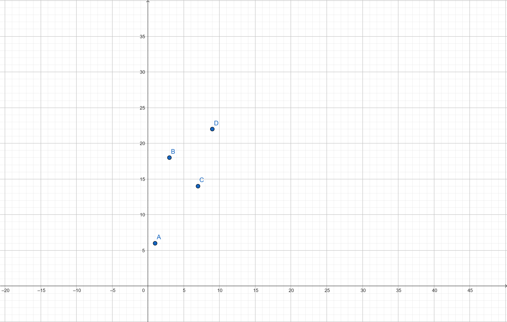

# 1 Vector Math Refresher

**Difficulty:** Easy | **Type:** L&L and D&L  

Before diving too deep into computer vision, our manager wants us to brush up on some **vector math basics** — an essential tool for geometric reasoning, transformations, and image analysis. She’s provided a collection of **2D and 3D vectors and points** and asked us to carry out a few calculations both **by hand** and using **NumPy** in Python.  

This is a practical review of operations like vector addition, subtraction, scalar multiplication, dot product, and cross product — all of which will come in handy later in the course.  

## Given Data  

**2D Vectors:**  
- $\vec{v_1} = \begin{pmatrix} 2 \\ 4 \end{pmatrix}$  
- $\vec{v_2} = \begin{pmatrix} 5 \\ 3 \end{pmatrix}$  
- $\vec{v_3} = \begin{pmatrix} 7 \\ 12 \end{pmatrix}$  
- $\vec{v_4} = \begin{pmatrix} 3 \\ 8 \end{pmatrix}$  

**3D Lines (direction vectors):**  
- $\vec{\ell_1} = \begin{pmatrix} -2 \\ 1 \\ 1 \end{pmatrix}$  
- $\vec{\ell_2} = \begin{pmatrix} 2 \\ 3 \\ 1 \end{pmatrix}$  

**3D Points:**  
- $P_1 (10, 6,2)$  
- $P_2 (2, 8, 1)$ 9 
- $P_3 (5, 3, 1)$  
- $P_4 (7, 9, 1)$  

---

## To-Dos  

1. **Vector Addition**  
   - Compute $v_1 + v_2$ by hand.  
   - Then verify the result using NumPy: `numpy.add(v1, v2)` or `v1 + v2`.

2. **Vector Subtraction**  
   - Compute $v_3 - v_2$ by hand.  
   - Then check with NumPy: `numpy.subtract(v3, v2)` or `v3 - v2`.

3. **Scalar Multiplication**  
   - Multiply vector $v_4$ by the scalar $5$ by hand.  
   - Then verify with NumPy: `5 * v4`.

4. **Dot Product**  
   - Compute the dot product of point $p_2$ and line $\ell_1$: $p_2 \cdot \ell_1$ by hand.  
   - Check the result using `numpy.dot(p2, l1)`.

5. **Cross Product**  
   - Compute the cross product of lines $\ell_1$ and $\ell_2$: $\ell_1 \times \ell_2$ by hand.  
   - Verify using `numpy.cross(l1, l2)`.

6. **Equivalence of Points**  
   - Examine the points $p_1$ to $p_4$.  
   - Which ones are **equivalent** (i.e., identical or representing the same direction/position)?  
   - Justify your answer with a brief explanation of how you identified equivalence (e.g., comparison of coordinates).

# 2 Drone Image Analysis

**Difficulty:** Medium | **Type:** L&L and D&L

**Generated with https://firefly.adobe.com/**

New week, new goals! Over the weekend, our ever-ambitious manager came up with a fresh idea — one that she hopes will boost revenue *and* speed up her early retirement plans. This time, she wants to use a **drone** to capture **perspective images** of a road intersection, including all the vehicles within it.

Your team has built a prototype system and written a test program that captures points and lines from an aerial image. The goal is to perform **geometric analysis** on this scene — insights which can later be used in applications like **traffic flow prediction** or **urban planning**.

From the drone image above, the following points and a line were detected (in homogeneous coordinates):

## Given Data

- $P_1 (500, 900, 1)$ *(blue point at the bottom)*  
- $P_2 (1700, 1300, 1)$ *(blue point at the top)*  

- $\vec{\ell_2} = \begin{pmatrix} 900 \\ 1050 \\ -2287500 \end{pmatrix}$ *(green line)*  

- $P_4 (1046, 1082, 1)$ *(white car marked with red X)*  
- $P_5 (1310, 1220, 1)$ *(black car marked with red X)*  

## To-Dos  

1. **Equivalence of Points**  
   - Are $p_1$ and $p_2$ *equivalent* (i.e., do they represent the same point in projective space)?  
   - Justify your answer using a suitable method, such as comparing if one is a scalar multiple of the other.

2. **Line Through Two Points**  
   - Calculate the line $\ell_1$ passing through $p_1$ and $p_2$ using the cross product:  
     $$ \ell_1 = p_1 \times p_2 $$

3. **Convert to Cartesian Line Equation**  
   - Convert $\ell_1 = (a, b, c)^T$ into the line equation:  
     $$ a \cdot x + b \cdot y + c = 0 $$  
   - Write down the equation explicitly.

4. **Find Slope and y-Intercept**  
   - Compute the slope $m$ and y-intercept $b$ of the line $\ell_1$ from its coefficients.  
   - Under which condition would this be **impossible**? (Hint: Think about vertical lines.)

5. **Intersection Point**  
   - Find the **intersection point** between $\ell_1$ and $\ell_2$ using the cross product:  
     $$ p = \ell_1 \times \ell_2 $$  
   - Normalize the result (convert from homogeneous to Cartesian coordinates).

6. **Point-on-Line Check**  
   - Determine whether either $p_4$ or $p_5$ lies on line $\ell_1$.  
   - Plug each point into the line equation:  
     $$ a \cdot x + b \cdot y + c = 0 $$  
   - A result close to 0 (within a small threshold like $10^{-5}$) means the point lies on the line.

# 3 More Drone Image Analysis

**Difficulty:** Medium | **Type:** D&L

**Generated with https://firefly.adobe.com/**

🚁 Uh-oh... Your drone has flown off course and accidentally landed inside a stranger’s apartment. Before anyone could recover it, it snapped a picture of a **wall with a window**. Seeing an opportunity, your always-business-minded manager had a brilliant idea:  

> "Why not simulate a protective metal crossbar on that window — maybe the owner will like it and order one from my brother’s security-grid factory!" 😏  

To assist with this clever marketing stunt, you’ve been tasked with performing a few geometric computations on the captured image. The goal is to calculate where to overlay a metal cross (as two lines) that aligns well with the window.  

The following data was extracted from the image:

- $P_1 (500, 250, 1)$ *(top blue point)*
- $P_2 (870. 1260, 1)$ *(bottom blue point)*

- $l_2 = \begin{pmatrix} -770 \\ -370 \\ 866000 \end{pmatrix}$ *(green line)*

- $l_3\begin{pmatrix} -40 \\ -370 \\ 501000 \end{pmatrix}$ *(yellow line)*

## Tasks

1. **Find Line l₁**  
   - Determine the line **l₁** that passes through the two given points p₁ and p₂.  
   - Express it as a **homogeneous vector** of the form (a, b, c)ᵀ.

2. **Intersect l₁ and l₂**  
   - Calculate the **intersection point** between l₁ and l₂.  
   - Perform the computation manually *and* verify your result using tools like `numpy.cross`.

3. **Find a parallel line to l₃ through p₁**  
   - Create a new line **l₃′** that passes through p₁ and is **parallel** to the given line l₃.  
   - Hint: Parallel lines in homogeneous coordinates share the same direction vector.

4. **Intersect l₃′ and l₃**  
   - Calculate the **intersection point** between your new line l₃′ and the original line l₃.  
   - Plotting these intersections on the image (if possible) would help visualize the metal grid structure.  

# 4 optional deep dive: data visualization with python

**Difficulty:** Easy | **Type:** O  

Ready to go the extra mile and earn some bonus points *plus* a certificate for your resume? Kaggle, a well-known platform for data science and machine learning, offers a variety of interactive and beginner-friendly courses. One of them focuses on **data visualization with Python**, where you’ll learn to turn data into insight using powerful libraries like `matplotlib` and `seaborn`.

## To-Do

Complete the **“Data Visualization”** course offered on Kaggle:

[https://www.kaggle.com/learn/data-visualization](https://www.kaggle.com/learn/data-visualization)