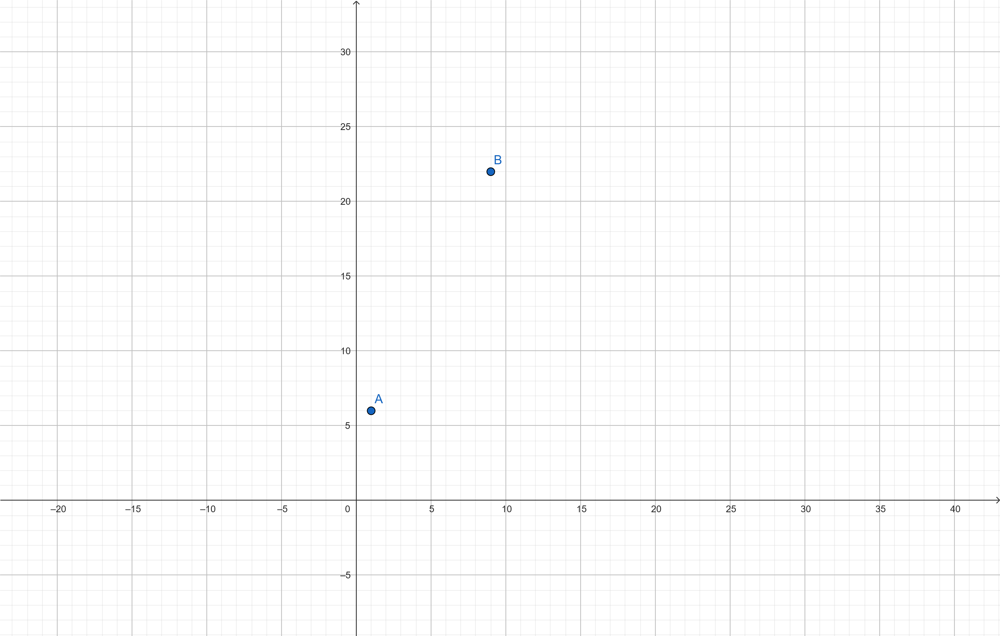
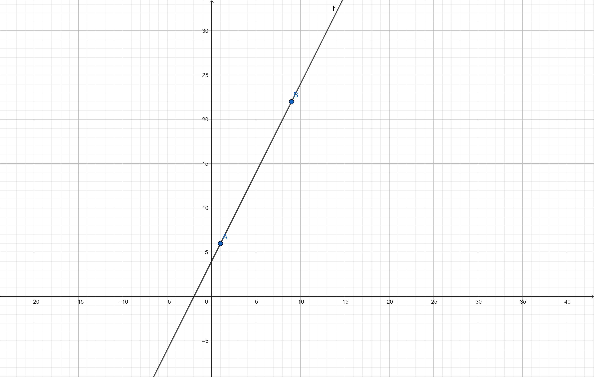
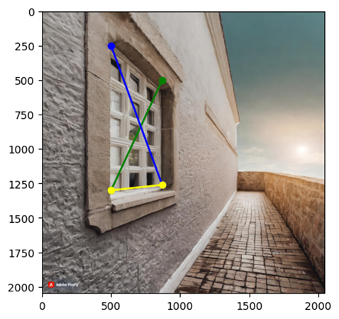
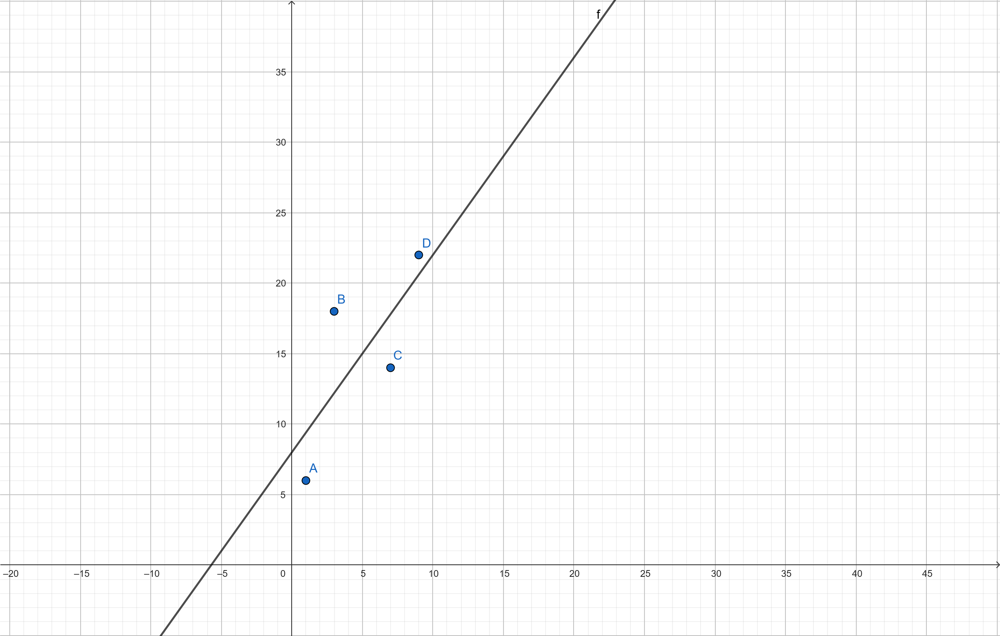
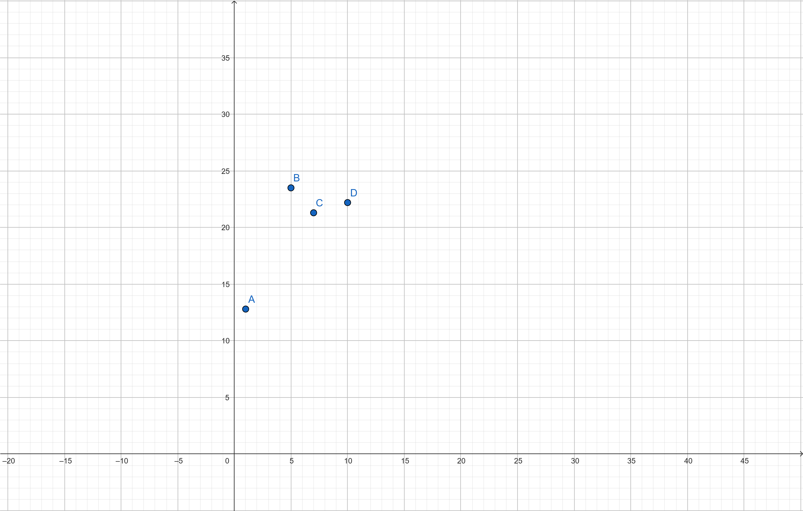
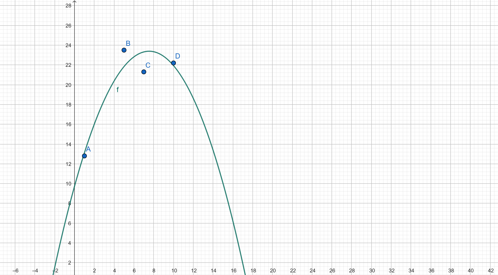

# 1. Geschwindigkeitserfassung eines Autos in einem Video


## 1.1


---

## 1.2

Gesucht ist eine lineare Funktion der Form:

```
y = a·x + b
```

Einsetzen der Werte:

```
6 = a·1 + b     (Gleichung 1)
22 = a·9 + b    (Gleichung 2)
```


## 1.3

In Matrixschreibweise:

$$
\begin{bmatrix}
1 & 1 \\
9 & 1
\end{bmatrix}
\cdot
\begin{bmatrix}
a \\
b
\end{bmatrix}
=
\begin{bmatrix}
6 \\
22
\end{bmatrix}
$$

Die Matrix ist invertierbar, da sie eine Determinante ungleich null hat und auch quadratisch ist:

$$
\text{det} = 1 \cdot 1 - 9 \cdot 1 = -8 \ne 0
$$


## 1.4

Aus Gleichung 1:

```
b = 6 - a
```

Einsetzen in Gleichung 2:

```
22 = 9a + (6 - a) = 8a + 6
=> 8a = 16
=> a = 2
=> b = 6 - 2 = 4
```

Also gesuchte Gerade:

```
y = 2x + 4
```


## 1.5

In der Übungsstunde vorgeführt.

## 1.6


Vorhersage bei t = 20 s (einfach einsetzen):

```
y = 2·20 + 4 = 44 km/h
```

# 2


## 2.1



---

## 2. Gleichungssystem aufstellen

Gesucht ist eine lineare Funktion der Form:


y = a·x + b


Einsetzen der Werte ergibt vier Gleichungen:

```
6 = a·1 + b (Gleichung 1)
18 = a·3 + b (Gleichung 2)
14 = a·7 + b (Gleichung 3)
22 = a·9 + b (Gleichung 4)
```

Da wir mehr Gleichungen als Unbekannte haben, ist das System überbestimmt.


## 2.3

$$
\begin{bmatrix}
1 & 1 \\
3 & 1 \\
7 & 1 \\
9 & 1 \\
\end{bmatrix}
\cdot
\begin{bmatrix}
a \\
b \\
\end{bmatrix}
=
\begin{bmatrix}
6 \\
18 \\
14 \\
22 \\
\end{bmatrix}
$$

Die Matrix ist nicht quadratisch und somit nicht invertierbar.


## 2.4

$$
x = (A^{T} A)^{-1} A^{T} y
$$

1. Transponiere A (Siehe Python-Notebook)
2. Berechne $(A^{T} A)$ (Siehe Python-Notebook)

3. Berechne $(A^{T} A)^{-1}$ (Siehe Python-Notebook)

4. Berechne $x$ durch $(A^{T} A)^{-1}$ $A^{T} y$ (Siehe Python-Notebook)

$$
x =
\begin{bmatrix}
1.4 \\
8 \\
\end{bmatrix}
$$


Also gesuchte Gerade:

$$
y = 1.4x + 8
$$

## 2.5

In der Übungsstunde vorgeführt.

## 2.6



Vorhersage der Geschwindigkeit bei \(t = 20\):

$$
y = 1.4 \cdot 20 + 8 = 36
$$

# 3


## 3.1




## 3.2

Gesucht ist eine quadratische Funktion der Form:

y = $a·x^2 + b·x + c$


Einsetzen der Werte:

$12.8 = a·1^2 + b·1 + c$ (Gleichung 1)

$23.5 = a·5^2 + b·5 + c$ (Gleichung 2)

$21.3 = a·7^2 + b·7 + c$ (Gleichung 3)

$22.2 = a·10^2 + b·10 + c$ (Gleichung 4)


## 3.2

$$
\begin{bmatrix}
1^2 & 1 & 1 \\
5^2 & 5 & 1 \\
7^2 & 7 & 1 \\
10^2 & 10 & 1 \\
\end{bmatrix}
\cdot
\begin{bmatrix}
a \\
b \\
c \\
\end{bmatrix}
=
\begin{bmatrix}
12.8 \\
23.5 \\
21.3 \\
22.2 \\
\end{bmatrix}
$$

Die Matrix ist nicht quadratisch (4x3) und somit nicht invertierbar.


## 3.4

Berechnung mit der Normalengleichung:

$$
x = (A^{T} A)^{-1} A^{T} y
$$

mit

$$
A =
\begin{bmatrix}
1 & 1 & 1 \\
25 & 5 & 1 \\
49 & 7 & 1 \\
100 & 10 & 1 \\
\end{bmatrix}
,
\quad
y =
\begin{bmatrix}
12.8 \\
23.5 \\
21.3 \\
22.2 \\
\end{bmatrix}
$$

Berechnungsschritte:

1. Transponiere A (Siehe Python-Notebook)
2. Berechne $(A^{T} A)$ (Siehe Python-Notebook)

3. Berechne $(A^{T} A)^{-1}$ (Siehe Python-Notebook)

4. Berechne $x$ durch $(A^{T} A)^{-1}$ $A^{T} y$ (Siehe Python-Notebook)


Hier die finalen Ergebnisse:


$$
y = -0.24 \cdot x^2 + 3.62 \cdot x + 9.74
$$


## 3.5

In der Übungsstunde vorgeführt.


## 3.6



Vorhersage der Geschwindigkeit bei \(t = 20\):

$$
y = -0.24 \cdot 20^2 + 3.62 \cdot 20 + 9.74 = -13.86
$$


## 4

Siehe [Scikit-Documentation](https://scikit-learn.org/stable/auto_examples/miscellaneous/plot_multioutput_face_completion.html)